# Beyond the Black Box: Auditing COMPAS and Building Fairer Recidivism Prediction Models

**Author:** Wenhao Chang | **Course:** Machine Learning I — Final Project | **Date:** March 2026

---

## The Problem

COMPAS (Correctional Offender Management Profiling for Alternative Sanctions) is one of the most widely used algorithmic risk tools in the U.S. criminal justice system. Courts rely on its 1–10 risk score to make bail, sentencing, and parole decisions for thousands of defendants every year.

But COMPAS has a fairness problem. Using the Broward County, Florida dataset (n = 6,171 defendants), this project replicates ProPublica's landmark finding: **COMPAS makes systematically different errors for Black and White defendants.** African-American defendants who never reoffended were falsely flagged as high risk at nearly double the rate of Caucasian defendants.

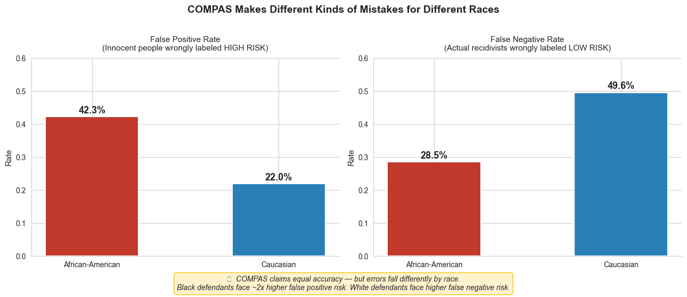
*COMPAS's false positive rate for African-American defendants (42.3%) is nearly double that of Caucasian defendants (22.0%). The system is pessimistic about Black futures and optimistic about White ones.*

---

## The Dataset

The Broward County COMPAS dataset contains 7,214 criminal defendants screened between 2013–2014. After standard filtering, 6,171 cases remain with a moderate class split: 54.5% did not recidivate, 45.5% did.

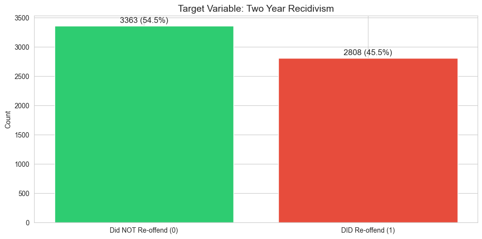

Recidivism rates vary meaningfully across demographics — younger defendants and male defendants show higher rates — which is critical context for understanding why models can inherit disparities from data.

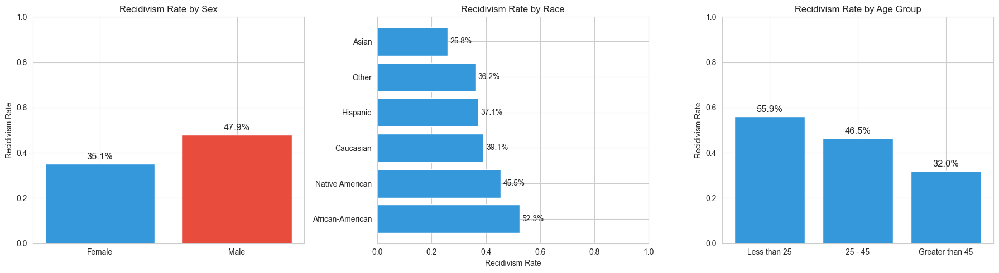

---

## The Approach

Four interpretable ML models were trained on 12 features (age, priors, charge degree, sex, race indicators) and benchmarked against COMPAS:

| Model | Accuracy | AUC | Precision | Recall | FPR | FNR | F1 |
|---|---|---|---|---|---|---|---|
| **COMPAS** | 65.9% | 0.716 | 63.3% | 59.6% | 28.8% | 40.4% | 0.61 |
| Logistic Regression | 67.9% | 0.728 | 68.6% | 54.1% | 20.7% | 45.9% | 0.60 |
| **Decision Tree** | **69.3%** | 0.726 | 68.1% | **61.2%** | 23.9% | 38.8% | **0.64** |
| Random Forest | 69.1% | **0.733** | **71.3%** | 53.6% | **18.4%** | 46.4% | 0.61 |
| XGBoost | 68.4% | 0.732 | 67.3% | 59.4% | 23.3% | 40.6% | 0.63 |

**Every ML model outperformed COMPAS** in accuracy, precision, and false positive rate.

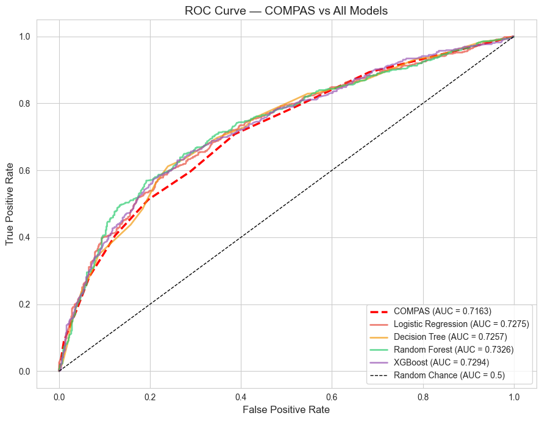
*All four models achieve higher AUC than COMPAS. The curves are tightly clustered, but all sit above COMPAS's curve.*

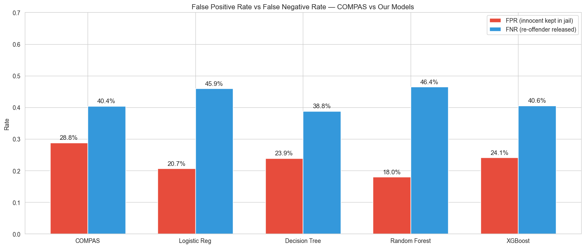
*Every ML model produces fewer false positives (wrongful high-risk labels) than COMPAS.*

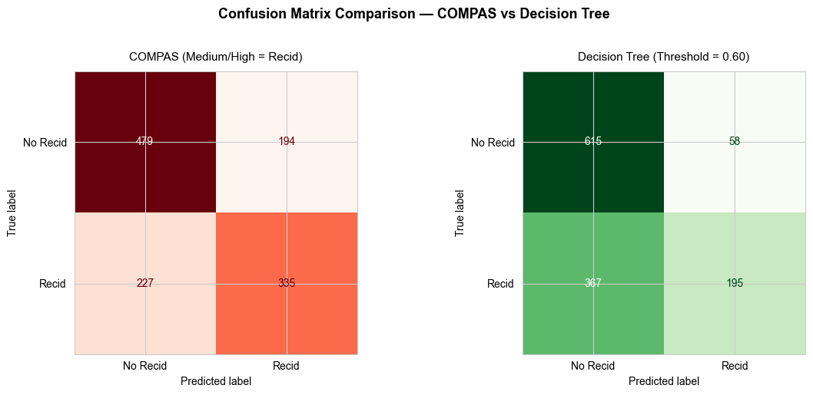
*Side-by-side: the Decision Tree correctly classifies more defendants and produces fewer false positives.*

---

## Fairness: Closing the Racial Gap

The real story isn't just accuracy — it's **who gets hurt by the errors.** By raising the Decision Tree's classification threshold from 0.50 to 0.60 (calibrated for non-violent cases where false positives are costlier), the racial FPR gap shrinks dramatically:

| Model | AA FPR | Caucasian FPR | **FPR Gap** |
|---|---|---|---|
| COMPAS | 40.1% | 20.7% | **19.5 pp** |
| Decision Tree (0.50) | 32.9% | 17.7% | **15.2 pp** |
| Decision Tree (0.60) | 13.9% | 4.9% | **9.0 pp** |

That's a **54% reduction** in racial disparity compared to COMPAS.

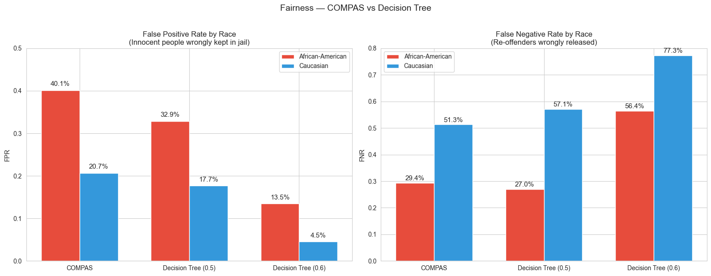
*The calibrated Decision Tree (0.60) substantially reduces the FPR gap between African-American and Caucasian defendants.*

The threshold was selected by analyzing how precision, recall, FPR, and FNR shift across operating points:

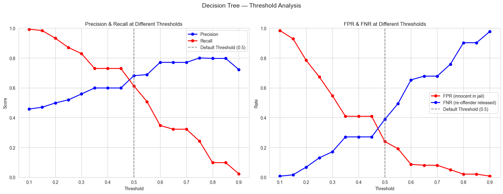
*At threshold 0.60: precision reaches 77.1% (meeting the 75% non-violent standard) with an FPR of just 8.6%.*

---

## Why It Predicts What It Predicts

Unlike COMPAS (a proprietary black box), these models are fully explainable. SHAP analysis reveals the top drivers of recidivism predictions:

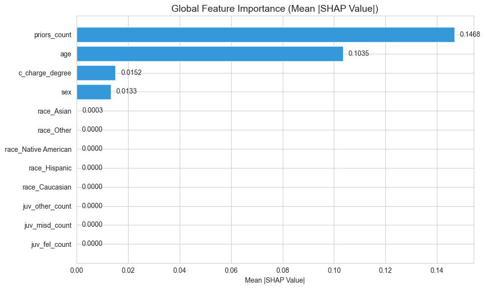
*Age and prior charges dominate predictions. Race indicators contribute relatively little — suggesting COMPAS's disparities come from its opaque weighting, not from the features themselves.*

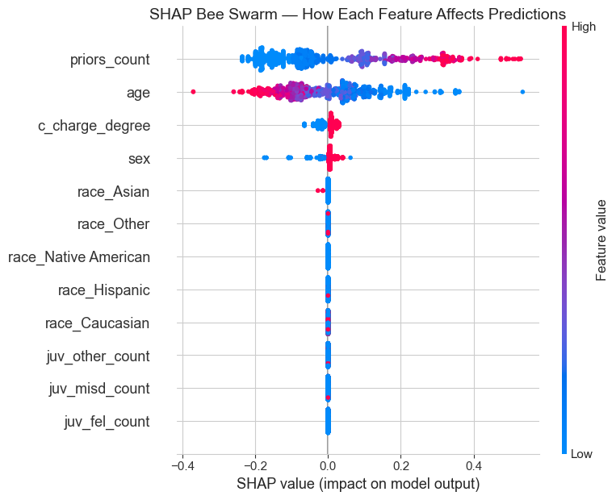
*Each dot is a defendant. Red = high feature value, blue = low. Younger age (blue dots pushed right) and more priors (red dots pushed right) are the clearest risk signals.*

---

## Case Study: Travis Power

Travis Power is a 22-year-old African-American male charged with a non-violent felony (drug possession). One prior charge, no juvenile felonies.

**COMPAS gave him a 10/10** — the maximum possible risk score. Our model says 57.8%.

| Metric | Our Model | COMPAS |
|---|---|---|
| Risk Score | 57.8% | 10/10 (100%) |
| Risk Label | Moderate | High |
| Default (0.50) | Deny | Deny |
| Calibrated (0.60) | **Grant** | Deny |

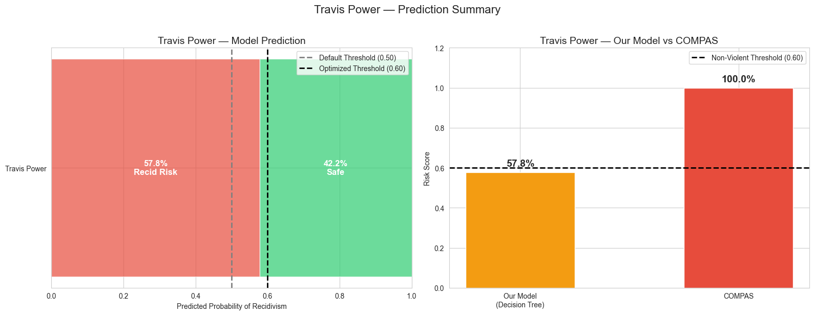

SHAP explains *why*: his young age is the main risk factor, but his minimal history pulls the prediction back down. A judge can see exactly what's driving the score.

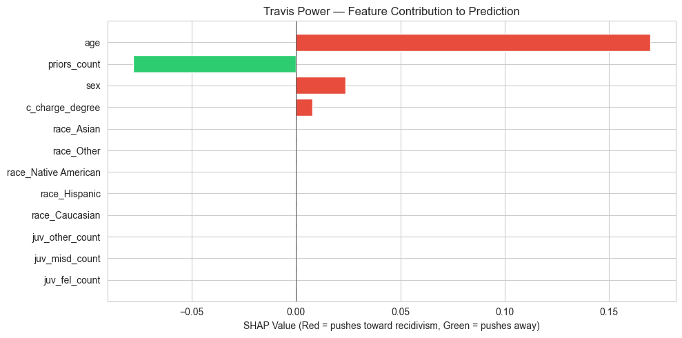
*Red bars push risk up (age); green bars push it down (low priors). The reasoning is fully transparent.*

**Actual outcome:** Power did reoffend — but it was non-violent (resisting/obstructing without violence). The calibrated model's philosophy holds: the reoffense was minor, and supervised liberty may have served rehabilitation better than incarceration.

---

## Three Takeaways

**1. Simple models beat the black box.** A Decision Tree — whose logic fits on a single page — outperforms COMPAS on accuracy, precision, and F1. Algorithmic complexity doesn't guarantee predictive superiority.

**2. Fairness is a dial, not a switch.** Threshold tuning lets practitioners explicitly choose where on the fairness–accuracy tradeoff they want to operate. The 0.60 threshold cut the racial FPR gap by more than half.

**3. Explainability is a requirement, not a feature.** A score of 10/10 tells a judge nothing. A SHAP plot tells them everything. When algorithms influence who goes free, the ability to understand, audit, and contest predictions is a due-process necessity.

---

## Repository Structure

```
├── README.md                                        # This file
├── assets/                                          # All figures
├── ML_Final_Project.html                            # Full analysis notebook (HTML export)
├── A Comparative Recidivism Risk Assessment...      # Formal research paper (.docx)
```
